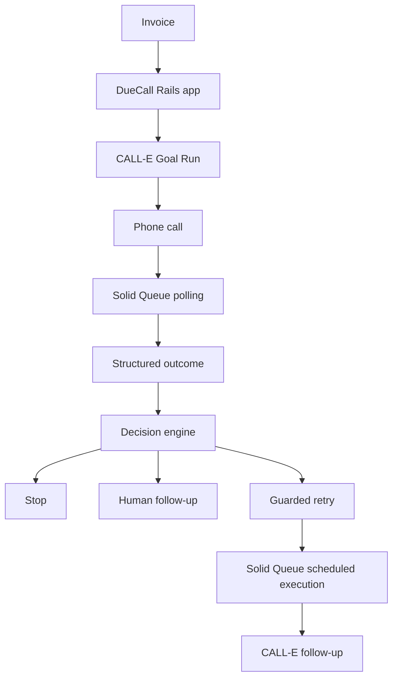
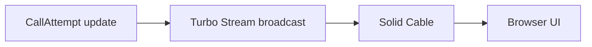

# DueCall

Autonomous AI accounts-receivable follow-up powered by CALL-E.

DueCall helps businesses automate the repetitive parts of chasing overdue
invoices: it places structured follow-up calls, reads the outcome, and either
closes the loop, schedules another guarded attempt, or hands the case to a
human. Ambiguous or risky situations — disputes, wrong contacts, missing
information — are routed to a person instead of being resolved automatically.

## What DueCall does

1. An overdue invoice is selected.
2. DueCall starts a CALL-E Goal Run for the authorized customer contact.
3. CALL-E returns structured payment outcome data.
4. DueCall decides whether to stop, retry, or require human follow-up.
5. Eligible retries can be scheduled and executed automatically during the
   contact's business hours.

The invoice and call-attempt pages update in real time as results arrive —
no manual refresh needed.

## Why autonomous accounts receivable follow-up

Accounts-receivable teams spend a lot of time repeating the same
follow-up call for overdue invoices. Many of those outcomes are routine —
a promise to pay, a "call back later," a payment already in flight — and
don't need a person on the line. DueCall automates that repetitive
follow-up, while failing closed to a human whenever the outcome is
ambiguous or the situation calls for judgment (a dispute, a wrong contact,
missing information, and so on).

## Architecture





## Safety and guardrails

- Autonomous follow-up is opt-in per invoice.
- Only overdue, open invoices are eligible for autonomous follow-up.
- Automatic scheduling respects the contact's configured timezone and
  business hours (weekdays, 9am–5pm local).
- There is a maximum number of automatic call submissions per invoice.
- Duplicate follow-up submission is prevented before a new automatic call
  is placed.
- CALL-E Goal Run submission is idempotent.
- A paid or cancelled invoice stops further automation.
- A contact with no configured timezone routes to human follow-up instead
  of guessing a schedule.
- Outcomes such as wrong contact, dispute, refusal, missing information,
  and other ambiguous results route to human follow-up rather than
  retrying automatically.
- Placing a real phone call manually requires an explicit confirmation
  step in the UI.

## CALL-E integration

DueCall creates a CALL-E Goal Run at runtime for the selected invoice and
contact. CALL-E performs the phone conversation, and DueCall polls the Goal
Run until a result is available. Structured fields returned by CALL-E —
outcome, reason, customer summary, and promise-to-pay date — drive all of
the downstream stop/retry/human-follow-up decisions above.

Configure these server-side environment variables:

* `CALLE_API_KEY` — CALL-E API key.
* `CALLE_OVERDUE_INVOICE_GOAL_ID` — public ID of the published overdue-invoice Goal.
* `DUECALL_CALLING_COMPANY_NAME` — company identity stated by the voice agent.
* `CALLE_BASE_URL` — optional; defaults to `https://api.heycall-e.com`.

The API key, Goal ID, and calling company name may instead be stored under
`calle.api_key`, `calle.overdue_invoice_goal_id`, and
`calle.calling_company_name` in Rails credentials. Never expose the API key to
browser code.

`call_attempt.run_calle_goal!` submits one Goal Run. The model derives a stable
idempotency key, saves the public Goal Run ID in `provider_goal_run_id`, and
records the provider response in `raw_result`.

`call_attempt.sync_calle_goal!` fetches that Goal Run once and synchronizes the
latest provider response. Result payloads remain intact in `raw_result` unless
an explicit published result schema is available for mapping.

## Real-time results

CALL-E → Solid Queue background polling → `CallAttempt` update → Turbo
Stream broadcast → Solid Cable → browser.

The current implementation does not use browser polling or CALL-E webhooks;
results reach the browser only through this Turbo Stream / Solid Cable path.

## Tech stack

- Ruby on Rails
- PostgreSQL
- CALL-E
- Solid Queue
- Solid Cable
- Turbo Streams
- Tailwind CSS
- Docker
- Render-ready deployment

## Screenshots / demo

Screenshots and demo media can be added here.

## Local development

Requirements: Ruby, PostgreSQL, and the versions pinned by the repository.
`bin/setup` runs `db:prepare`, which seeds a demo contact, so set
`DUECALL_DEMO_PHONE` to a valid E.164 phone number first (see
`db/seeds.rb`).

```bash
DUECALL_DEMO_PHONE=+15555550123 bin/setup
bin/dev
```

`bin/dev` starts three processes (see `Procfile.dev`): the Rails server, the
Tailwind watcher, and a Solid Queue worker (`bin/jobs`). Real-time updates on
the CallAttempt page are delivered over Action Cable using Solid Cable, so
development also uses three separate logical PostgreSQL databases —
`duecall_development`, `duecall_development_queue`, and
`duecall_development_cable` — configured in `config/database.yml` and
`config/cable.yml`.

## Testing

```bash
bin/rspec
```

## Deployment

DueCall can optionally be deployed to Render using the included
[Render Blueprint](render.yaml); no other deployment target is required to
run the app.

The Blueprint provisions one Docker web service and one PostgreSQL instance
in Singapore. Rails uses four logical databases on that single instance:

- `duecall_production`
- `duecall_production_cache`
- `duecall_production_queue`
- `duecall_production_cable`

The Blueprint supplies Render's internal PostgreSQL `connectionString` as
`DATABASE_URL`. The Rails database configuration (`config/database.yml`)
preserves that URL's scheme, credentials, host, port, and query parameters
while replacing only its database path for each logical database.

Solid Queue runs inside the same Puma process as the web server
(`SOLID_QUEUE_IN_PUMA=1`, see `config/puma.rb`) — there is no separate Render
background worker. Solid Cable uses its own `cable` logical database
(`config/cable.yml`, `config/environments/production.rb`).

The existing Docker entrypoint (`bin/docker-entrypoint`) runs
`bin/rails db:prepare` before starting Rails. On the initial deployment this
creates and prepares all four logical databases and seeds the primary
database (`db/seeds.rb`). On later deployments, `db:prepare` migrates
existing databases without reseeding an already-initialized primary
database.

The Blueprint uses Render's free plans for an initial demo. Free Render
PostgreSQL instances currently expire after 30 days, so upgrade the database
plan before using this setup for persistent production data.

### Required secrets

Render prompts for these when you create the Blueprint (`sync: false` in
`render.yaml`, never stored in the repository):

* `RAILS_MASTER_KEY` — from `config/master.key`.
* `CALLE_API_KEY` — CALL-E API key.
* `DUECALL_DEMO_PASSWORD` — password for the seeded demo user.
* `DUECALL_DEMO_PHONE` — E.164 phone number for the seeded demo contact.
  `db/seeds.rb` requires this to be a valid E.164 number and raises during
  `db:prepare` if it is missing, so the very first deploy will fail to boot
  without it.

To actually place CALL-E calls (not just seed demo data), also add these as
regular environment variables on the web service after the Blueprint is
created — they are not part of `render.yaml` because they configure CALL-E
call behavior rather than infrastructure:

* `CALLE_OVERDUE_INVOICE_GOAL_ID` — public ID of the published overdue-invoice
  Goal.
* `DUECALL_CALLING_COMPANY_NAME` — company identity stated by the voice
  agent.

`DUECALL_DEMO_SEED` and `DUECALL_DEMO_EMAIL` are set by the Blueprint for
forward compatibility with a richer demo seed, but the current
`db/seeds.rb` seeds a single fixed demo account and does not read either
variable yet.

### To deploy

1. In Render, create a Blueprint from `render.yaml`.
2. Enter the requested secret values (`RAILS_MASTER_KEY`, `CALLE_API_KEY`,
   `DUECALL_DEMO_PASSWORD`, `DUECALL_DEMO_PHONE`). Do not store these values
   in the repository.
3. Wait for the initial Docker deployment and database preparation to
   finish.
4. Verify `https://<actual-render-hostname>/up` returns a successful
   response.
5. Add `CALLE_OVERDUE_INVOICE_GOAL_ID` and `DUECALL_CALLING_COMPANY_NAME` to
   the web service's environment if you want real CALL-E calls to succeed,
   then redeploy or restart.
6. Sign in as `demo@duecall.local` with the configured
   `DUECALL_DEMO_PASSWORD`.

Render terminates HTTPS at its load balancer. Thruster listens for public
HTTP traffic on port 10000 (`HTTP_PORT`) and forwards it to Puma on port 3000
(`TARGET_PORT`); Thruster TLS is intentionally not enabled.

The production Active Storage service currently uses the container's local
disk. Render web-service filesystems are ephemeral, so persistent uploads
will require object storage in a future deployment.
